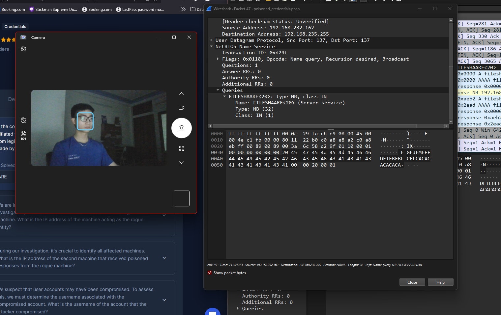

# Instructions:

   ## Uncompress the lab (pass: cyberdefenders.org)

# Scenario:

## Your organization's security team has detected a surge in suspicious network activity. There are concerns that LLMNR (Link-Local Multicast Name Resolution) and NBT-NS (NetBIOS Name Service) poisoning attacks may be occurring within your network. These attacks are known for exploiting these protocols to intercept network traffic and potentially compromise user credentials. Your task is to investigate the network logs and examine captured network traffic.

# Tools:

   ## Wireshark

# File:
File: [File](LabFile/poisoned_credentials.pcap)

## Q1: In the context of the incident described in the scenario, the attacker initiated their actions by taking advantage of benign network traffic from legitimate machines. Can you identify the specific mistyped query made by the machine with the IP address 192.168.232.162?
### Solution
* Mình lướt tìm thì thấy packet Name query NB

`Answer: FILESHAARE`

## Q2: 
