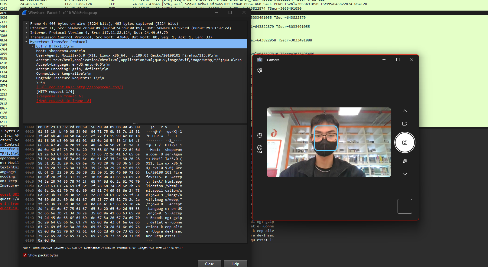
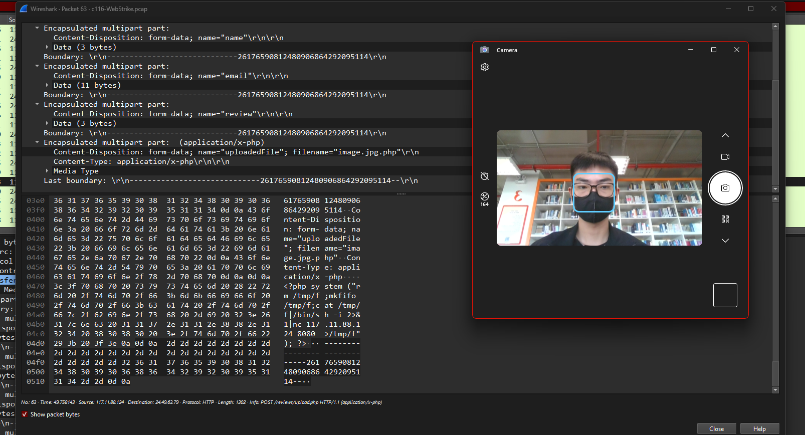

# Instructions:
  ### Uncompress the lab (pass: cyberdefenders.org)

# Scenario:

  ### An anomaly was discovered within our company's intranet as our Development team found an unusual file on one of our web servers. Suspecting potential malicious activity, the network team has prepared a pcap file with critical network traffic for analysis for the security team, and you have been tasked with analyzing the pcap.

# Tools:
  ### Wireshark

# File:
file: [LabFile](LabFiles/c116-WebStrike.pcap)
  
## Q1: Understanding the geographical origin of the attack aids in geo-blocking measures and threat intelligence analysis. What city did the attack originate from?

### Solution
* Mở file pcap bằng Wireshark
* Ở câu này, yêu cầu tìm địa chỉ thành phố của bên attack
* Mình nhận thấy file đã capture được source ip là 117.11.88.124
* Mình đã lên gg và search find place from ip address và tìm được một web
* Nhập địa chỉ ip vào đó và đã tìm được address là thành phố Tianjin, China

`Answer: Tianjin`

## Q2: Knowing the attacker's user-agent assists in creating robust filtering rules. What's the attacker's user agent?

### Solution
* Xem gói có Protocol HTTP có phương thức GET cho phép chúng ta lấy được một số thông tin bên máy chủ gửi dữ liệu

`Answer: Mozilla/5.0 (X11; Linux x86_64; rv:109.0) Gecko/20100101 Firefox/115.0`

## Q2: We need to identify if there were potential vulnerabilities exploited. What's the name of the malicious web shell uploaded?
### Solution
* Yêu cầu là tìm file chứa mã độc thì mình đã tìm những packet HTTP có phương thức POST và tìm thấy file được upload
* So sánh các file đó với answer format và mình đã tìm thấy file theo yêu cầu

`Answer: image.jpg.php`
