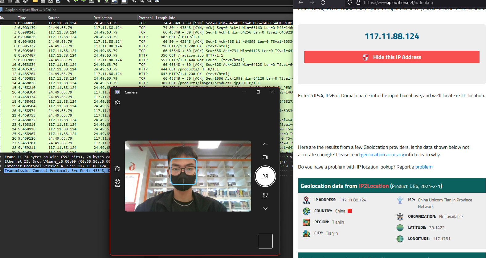

# Q1: Understanding the geographical origin of the attack aids in geo-blocking measures and threat intelligence analysis. What city did the attack originate from?
## Instructions:
  Uncompress the lab (pass: cyberdefenders.org)

## Scenario:

  An anomaly was discovered within our company's intranet as our Development team found an unusual file on one of our web servers. Suspecting potential malicious activity, the network team has prepared a pcap file with critical network traffic for analysis for the security team, and you have been tasked with analyzing the pcap.

## Tools:
  Wireshark

file: [Q1_File](LabFiles/c116-WebStrike.pcap)

## Solve:
* Mở file pcap bằng Wireshark
* Ở câu này, yêu cầu tìm địa chỉ thành phố của bên attack
* Mình nhận thấy file đã capture được source ip là 117.11.88.124
* Mình đã lên gg và search find place from ip address và tìm được một web
* Nhập địa chỉ ip vào đó và đã tìm được address là thành phố Tianjin, China

`Answer: Tianjin`
